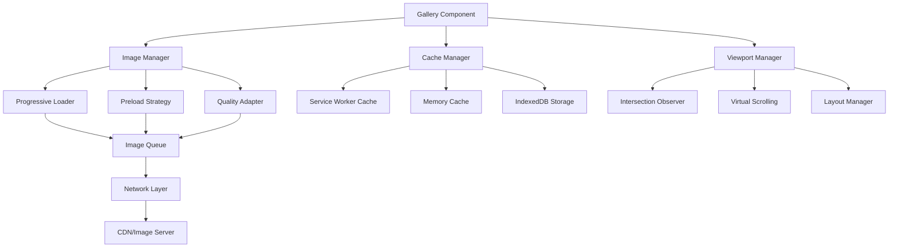

# Gallery Performance Optimization Design

## Overview

This design implements a high-performance image gallery system that addresses the current performance bottlenecks in the Tozan Pilgrimage Gallery. The solution combines progressive loading, intelligent caching, virtual scrolling, and adaptive loading strategies to create a smooth user experience while handling 329+ images efficiently.

The design focuses on three core principles:
1. **Progressive Enhancement**: Start with basic functionality and enhance with advanced features
2. **Adaptive Loading**: Adjust behavior based on device capabilities and network conditions
3. **Intelligent Caching**: Minimize redundant network requests through smart cache management

## Architecture

### High-Level Architecture



### Component Interaction Flow

1. **Gallery Component** orchestrates all operations and manages UI state
2. **Image Manager** handles loading strategies and image lifecycle
3. **Cache Manager** provides multi-tier caching with intelligent eviction
4. **Viewport Manager** optimizes rendering and manages visible content
5. **Network Layer** handles actual image requests with retry logic

## Components and Interfaces

### 1. Gallery Component (Main Controller)

```typescript
interface GalleryComponent {
  // Core properties
  images: ImageMetadata[]
  currentFilter: string
  viewportState: ViewportState
  loadingState: LoadingState
  
  // Methods
  initialize(): Promise<void>
  applyFilter(filter: string): void
  handleScroll(event: ScrollEvent): void
  handleResize(event: ResizeEvent): void
  destroy(): void
}

interface ImageMetadata {
  id: string
  url: string
  thumbnailUrl: string
  category: string
  alt: string
  dimensions: { width: number; height: number }
  priority: number
  cached: boolean
}
```

### 2. Image Manager

```typescript
interface ImageManager {
  // Loading control
  loadImage(metadata: ImageMetadata): Promise<HTMLImageElement>
  preloadImages(metadataList: ImageMetadata[]): Promise<void>
  cancelLoading(imageId: string): void
  
  // Quality management
  getOptimalImageUrl(metadata: ImageMetadata, viewport: ViewportInfo): string
  adaptQuality(networkSpeed: NetworkSpeed): QualitySettings
  
  // State management
  getLoadingState(): LoadingState
  getPendingCount(): number
}

interface QualitySettings {
  maxWidth: number
  quality: number
  format: 'webp' | 'jpeg' | 'auto'
}
```

### 3. Cache Manager

```typescript
interface CacheManager {
  // Cache operations
  get(key: string): Promise<CachedImage | null>
  set(key: string, image: CachedImage): Promise<void>
  delete(key: string): Promise<void>
  clear(): Promise<void>
  
  // Cache management
  getSize(): Promise<number>
  evictLRU(targetSize: number): Promise<void>
  preload(keys: string[]): Promise<void>
  
  // Cache strategies
  setCacheStrategy(strategy: CacheStrategy): void
}

interface CachedImage {
  blob: Blob
  metadata: ImageMetadata
  timestamp: number
  accessCount: number
  lastAccessed: number
}
```

### 4. Viewport Manager

```typescript
interface ViewportManager {
  // Viewport tracking
  getVisibleImages(): string[]
  getNearbyImages(threshold: number): string[]
  isImageVisible(imageId: string): boolean
  
  // Virtual scrolling
  getVirtualizedItems(): VirtualItem[]
  updateViewport(scrollTop: number): void
  
  // Layout management
  calculateLayout(): LayoutInfo
  getImagePosition(imageId: string): Position
}

interface VirtualItem {
  id: string
  top: number
  height: number
  visible: boolean
}
```

## Data Models

### Loading State Management

```typescript
interface LoadingState {
  totalImages: number
  loadedImages: number
  failedImages: number
  currentBatch: string[]
  pendingBatches: string[][]
  isLoading: boolean
  error: string | null
}

interface NetworkState {
  speed: 'slow' | 'medium' | 'fast'
  effectiveType: string
  downlink: number
  rtt: number
  saveData: boolean
}
```

### Cache Configuration

```typescript
interface CacheConfig {
  maxMemorySize: number // bytes
  maxDiskSize: number // bytes
  defaultTTL: number // seconds
  evictionPolicy: 'lru' | 'lfu' | 'ttl'
  compressionEnabled: boolean
  encryptionEnabled: boolean
}
```

### Performance Metrics

```typescript
interface PerformanceMetrics {
  imageLoadTimes: Map<string, number>
  cacheHitRate: number
  memoryUsage: number
  networkRequests: number
  scrollPerformance: FrameMetrics[]
  userInteractions: InteractionMetrics[]
}
```

## Correctness Properties

*A property is a characteristic or behavior that should hold true across all valid executions of a system-essentially, a formal statement about what the system should do. Properties serve as the bridge between human-readable specifications and machine-verifiable correctness guarantees.*

### Property 1: Initial Load Performance
*For any* gallery page load, the first 20 images should be displayed within 2 seconds of page initialization
**Validates: Requirements 1.1**

### Property 2: Progressive Loading Threshold
*For any* image in the gallery, loading should begin when the image is within 200 pixels of entering the viewport
**Validates: Requirements 2.1**

### Property 3: Concurrent Request Limiting
*For any* point in time during image loading, the number of active image requests should never exceed 6
**Validates: Requirements 2.2**

### Property 4: Cache Retrieval Performance
*For any* previously cached image, retrieval from cache should complete within 100ms
**Validates: Requirements 3.1**

### Property 5: Cache Eviction Policy
*For any* cache that reaches capacity, the least recently used images should be removed first
**Validates: Requirements 3.3**

### Property 6: Layout Stability
*For any* image loading operation, the total layout height should remain constant (no layout shift)
**Validates: Requirements 1.4**

### Property 7: Viewport Priority Loading
*For any* scrolling operation, images currently visible in the viewport should be prioritized over images that have been scrolled past
**Validates: Requirements 2.3**

### Property 8: Responsive Image Selection
*For any* device screen resolution, the gallery should request image sizes appropriate for that resolution
**Validates: Requirements 4.1**

### Property 9: Memory Management
*For any* situation where memory usage exceeds safe limits, off-screen images should be unloaded from memory
**Validates: Requirements 4.3**

### Property 10: Category Switching Performance
*For any* category switch operation, cached images should display immediately while uncached images load progressively
**Validates: Requirements 5.1**

### Property 11: Filter Loading Efficiency
*For any* active filter, only images matching that filter should be loaded
**Validates: Requirements 5.4**

### Property 12: Loading Indicator Management
*For any* loading state, skeleton placeholders should be displayed with correct dimensions until images load
**Validates: Requirements 6.1**

### Property 13: Error State Handling
*For any* failed image load, retry options and error states should be displayed
**Validates: Requirements 6.3**

### Property 14: Service Worker Cache Integration
*For any* caching operation, a service worker should be used for advanced cache management
**Validates: Requirements 7.1**

### Property 15: Predictive Preloading
*For any* detected scrolling pattern, the system should predict and preload likely next images
**Validates: Requirements 8.2**

## Error Handling

### Network Error Handling

```typescript
interface ErrorHandler {
  handleImageLoadError(imageId: string, error: Error): void
  handleNetworkError(error: NetworkError): void
  handleCacheError(error: CacheError): void
  retryFailedImage(imageId: string, maxRetries: number): Promise<void>
}
```

**Error Recovery Strategies:**

1. **Image Load Failures**: Implement exponential backoff retry with maximum 3 attempts
2. **Network Timeouts**: Fallback to lower quality images or cached versions
3. **Cache Corruption**: Clear corrupted entries and reload from network
4. **Memory Pressure**: Gracefully degrade by reducing concurrent loads
5. **Service Worker Errors**: Fallback to direct network requests

### User Experience During Errors

- Display meaningful error messages with retry options
- Maintain gallery functionality even with partial failures
- Provide offline indicators when network is unavailable
- Show progress indicators during retry attempts
- Allow manual refresh of failed images

## Testing Strategy

### Unit Testing Approach

**Core Components Testing:**
- Image Manager: Test loading queues, priority handling, and quality adaptation
- Cache Manager: Test cache operations, eviction policies, and storage limits
- Viewport Manager: Test intersection detection and virtual scrolling calculations
- Network Layer: Test request throttling, retry logic, and error handling

**Mock Strategies:**
- Mock Intersection Observer API for viewport testing
- Mock Service Worker for cache testing
- Mock network requests for loading simulation
- Mock performance APIs for timing validation

### Property-Based Testing Approach

**Testing Framework:** Use **fast-check** for JavaScript property-based testing with minimum 100 iterations per property.

**Generator Strategies:**
- **Image Collections**: Generate random sets of 50-500 images with varying sizes and categories
- **Viewport Scenarios**: Generate different screen sizes, scroll positions, and device orientations
- **Network Conditions**: Generate various connection speeds, latency, and reliability scenarios
- **User Interactions**: Generate scroll patterns, filter changes, and navigation sequences
- **Cache States**: Generate different cache fill levels and eviction scenarios

**Property Test Implementation:**
Each property-based test will be tagged with the format: **Feature: gallery-performance-optimization, Property {number}: {property_text}**

**Key Property Tests:**
1. **Load Performance**: Verify first 20 images load within time limits across different conditions
2. **Concurrent Limits**: Ensure request limits are never exceeded regardless of user behavior
3. **Cache Consistency**: Verify cache operations maintain data integrity under all conditions
4. **Memory Management**: Test memory cleanup works correctly under various memory pressure scenarios
5. **Viewport Accuracy**: Ensure intersection detection works correctly across all viewport configurations

### Integration Testing

**End-to-End Scenarios:**
- Full gallery load with network simulation
- Category switching with mixed cache states
- Mobile device simulation with orientation changes
- Offline/online transitions
- Memory pressure simulation

**Performance Benchmarks:**
- Initial load time targets: < 2 seconds for first 20 images
- Cache retrieval targets: < 100ms for cached images
- Scroll performance targets: > 60fps during loading
- Memory usage targets: < 100MB for 100 loaded images

### Browser Compatibility Testing

**Target Browsers:**
- Chrome 90+ (primary target)
- Firefox 88+ (secondary)
- Safari 14+ (secondary)
- Edge 90+ (secondary)

**Feature Detection:**
- Intersection Observer API support
- Service Worker support
- WebP format support
- Network Information API support

## Implementation Notes

### Performance Considerations

1. **Virtual Scrolling**: Implement for galleries with 100+ images to reduce DOM overhead
2. **Image Compression**: Use WebP with JPEG fallback for optimal file sizes
3. **CDN Integration**: Leverage CDN for global image delivery and automatic optimization
4. **Critical Path**: Prioritize above-the-fold images and defer non-essential features
5. **Bundle Splitting**: Load gallery features progressively to reduce initial bundle size

### Browser API Usage

1. **Intersection Observer**: For efficient viewport detection
2. **Service Worker**: For advanced caching and offline support
3. **Network Information API**: For adaptive loading based on connection quality
4. **Performance Observer**: For monitoring and optimization
5. **Web Workers**: For image processing and cache management

### Accessibility Considerations

1. **Screen Readers**: Ensure proper alt text and ARIA labels
2. **Keyboard Navigation**: Support keyboard-only gallery navigation
3. **Reduced Motion**: Respect prefers-reduced-motion settings
4. **High Contrast**: Maintain visibility in high contrast modes
5. **Focus Management**: Proper focus handling during dynamic loading

### Security Considerations

1. **Content Security Policy**: Restrict image sources to trusted domains
2. **Cache Isolation**: Prevent cache poisoning between different origins
3. **Service Worker Security**: Validate all cached content integrity
4. **Memory Safety**: Prevent memory leaks from retained image references
5. **Input Validation**: Sanitize all image URLs and metadata

This design provides a comprehensive foundation for implementing a high-performance, user-friendly gallery system that can efficiently handle large image collections while maintaining excellent user experience across all devices and network conditions.